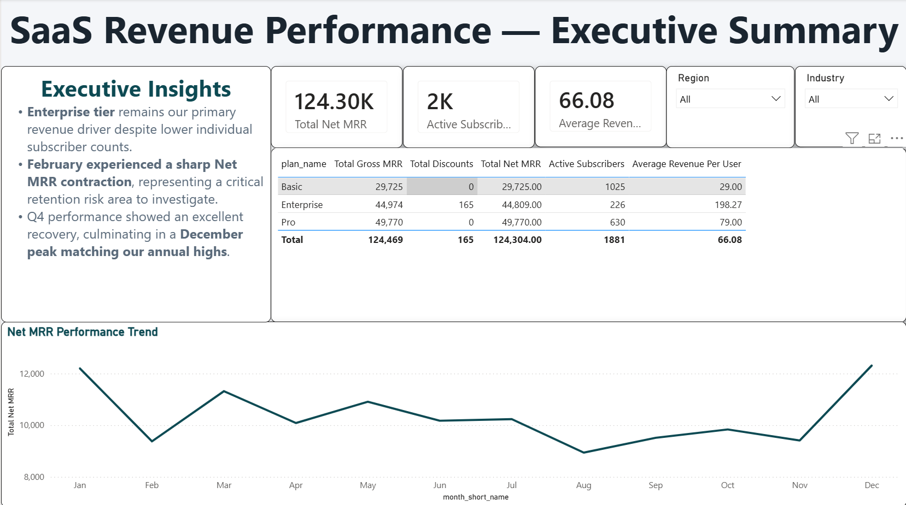

# HarbourMetrics: SaaS Revenue & Retention Analytics

An end-to-end business intelligence project that simulates a B2B SaaS subscription business, models its customer lifecycle in PostgreSQL, calculates revenue and retention KPIs, and presents the results in an executive Power BI dashboard.

## Project Overview

HarbourMetrics demonstrates a complete analytics workflow across:

- Relational database design
- Synthetic data generation
- Subscription-event modelling
- MRR, ARR, churn and cohort analysis
- Power BI semantic modelling
- DAX measures and executive storytelling

### Completed modules

- [x] Database architecture and relational DDL
- [x] Data simulation for 2,000 customers across a 24-month business scenario
- [x] Analytical SQL for revenue, churn, upgrades and cohorts
- [x] Power BI data model and DAX measures
- [x] Executive dashboard design

## Dashboard Preview

<p align="center">
  
</p>

## Business Questions

- How are MRR and ARR changing over time?
- Which subscription plans generate the most recurring revenue?
- Where are churn and contraction affecting performance?
- Which acquisition channels produce the strongest customer value?
- How do upgrades and downgrades affect Net MRR?
- How does customer retention change across signup cohorts?

## Data Model

The PostgreSQL model contains:

- `harbourmetrics.customers` — customer and firmographic attributes
- `harbourmetrics.plans` — subscription tiers and pricing
- `harbourmetrics.subscriptions` — current contract state
- `harbourmetrics.subscription_events` — signup, upgrade, downgrade, churn and reactivation events
- `harbourmetrics.calendar_dim` — continuous date dimension for time intelligence

## Repository Structure

```text
HarbourMetrics/
├── 01_sql_setup/
│   ├── 01_schema.sql
│   ├── 02_tables_customers.sql
│   ├── 03_tables_plans.sql
│   ├── 04_tables_subscriptions.sql
│   ├── 05_tables_events.sql
│   └── 06_calendar_dim.sql
├── 02_data_generation/
│   ├── 01_seed_customers.sql
│   ├── 02_seed_plans.sql
│   ├── 03_seed_subscriptions.sql
│   └── 04_generate_events.sql
├── 03_kpi_queries/
│   ├── 01_mrr.sql
│   ├── 02_arr.sql
│   ├── 03_churn_rate.sql
│   ├── 04_revenue_by_plan.sql
│   ├── 05_upgrade_downgrade.sql
│   ├── 06_customer_segmentation.sql
│   └── 07_cohort_analysis.sql
├── 04_power_bi/
│   └── HarbourMetrics_SaaS_Analytics.pbix
├── assets/
│   └── Dashboard.png
├── .gitignore
└── README.md
```

## SQL Example: Monthly Revenue Events

This example summarises monthly signups and churn events by subscription plan using the actual PostgreSQL schema and table names in this repository.

```sql
WITH monthly_events AS (
    SELECT
        DATE_TRUNC('month', se.event_date)::DATE AS reporting_month,
        COALESCE(se.new_plan_id, se.old_plan_id) AS plan_id,
        COUNT(*) FILTER (WHERE se.event_type = 'signup') AS new_signups,
        COUNT(*) FILTER (WHERE se.event_type = 'churn') AS cancellations
    FROM harbourmetrics.subscription_events AS se
    GROUP BY
        DATE_TRUNC('month', se.event_date)::DATE,
        COALESCE(se.new_plan_id, se.old_plan_id)
)
SELECT
    me.reporting_month,
    p.plan_name,
    p.base_price,
    me.new_signups * p.base_price AS gross_new_mrr,
    me.cancellations * p.base_price AS churned_mrr
FROM monthly_events AS me
JOIN harbourmetrics.plans AS p
    ON me.plan_id = p.plan_id
ORDER BY me.reporting_month, p.plan_name;
```

The complete KPI logic is stored in `03_kpi_queries/`.

## DAX Example: Active Subscribers

After importing the PostgreSQL tables into Power BI, the active-subscriber measure can be expressed as:

```DAX
Active Subscribers =
VAR ReportingDate = MAX(calendar_dim[date_id])
RETURN
CALCULATE(
    DISTINCTCOUNT(subscriptions[customer_id]),
    FILTER(
        subscriptions,
        subscriptions[start_date] <= ReportingDate
            && (
                ISBLANK(subscriptions[end_date])
                || subscriptions[end_date] > ReportingDate
            )
    )
)
```

Power BI may apply different display names during import. The measure should reference the imported `subscriptions` and `calendar_dim` tables.

## Key Insights

- The Enterprise plan is the largest recurring-revenue contributor despite serving fewer customers than lower-priced tiers.
- February shows a material Net MRR contraction and should be investigated for churn and downgrade drivers.
- Revenue recovers strongly during the final quarter, with December returning to an annual performance peak.

Because the project uses simulated data, these findings demonstrate analytical interpretation rather than describe a real company.

## How to Run the Project

### Prerequisites

- PostgreSQL 14 or later
- A PostgreSQL client such as DBeaver or pgAdmin
- Power BI Desktop
- Git

### 1. Clone the repository

```bash
git clone https://github.com/Shakya658/HarbourMetrics.git
cd HarbourMetrics
```

### 2. Create the schema and tables

Run the files below in order:

```text
01_sql_setup/01_schema.sql
01_sql_setup/02_tables_customers.sql
01_sql_setup/03_tables_plans.sql
01_sql_setup/04_tables_subscriptions.sql
01_sql_setup/05_tables_events.sql
01_sql_setup/06_calendar_dim.sql
```

### 3. Generate the simulated data

Run:

```text
02_data_generation/01_seed_customers.sql
02_data_generation/02_seed_plans.sql
02_data_generation/03_seed_subscriptions.sql
02_data_generation/04_generate_events.sql
```

### 4. Run the KPI queries

Execute the scripts in `03_kpi_queries/` in numerical order.

```text
03_kpi_queries/01_mrr.sql
03_kpi_queries/02_arr.sql
03_kpi_queries/03_churn_rate.sql
03_kpi_queries/04_revenue_by_plan.sql
03_kpi_queries/05_upgrade_downgrade.sql
03_kpi_queries/06_customer_segmentation.sql
03_kpi_queries/07_cohort_analysis.sql
```

### 5. Open the Power BI report

Open:

```text
04_power_bi/HarbourMetrics_SaaS_Analytics.pbix
```

In Power BI Desktop:

1. Select **Transform data**.
2. Open **Data source settings**.
3. Replace the existing PostgreSQL connection with your local server and database details.
4. Apply the changes and refresh the report.

## Simulation and Reproducibility

The project intentionally uses PostgreSQL `RANDOM()` to generate synthetic customers and lifecycle events. Running the data-generation scripts again may produce different row distributions, churn events and dashboard values.

The percentages embedded in the generation logic represent business assumptions for the portfolio scenario, not observed behaviour from a real SaaS company. The current dashboard screenshot reflects one completed simulation run.

## Tech Stack

- PostgreSQL
- SQL
- Power BI Desktop
- Power Query
- DAX
- DBeaver
- Git and GitHub

## Author

**Shirish Man Shakya**  
Data Analyst | Business Intelligence | Predictive Analytics

- [Portfolio](https://shakya658.github.io/portfolio/)
- [LinkedIn](https://linkedin.com/in/shirish-man-shakya)
- [GitHub](https://github.com/Shakya658)
